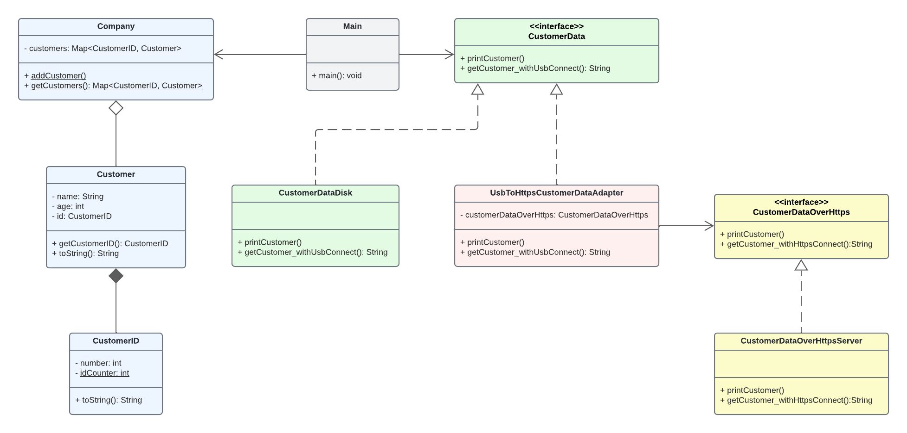

# :electric_plug: Legacy Systems


This project implements a software system that allows the interface of the old system to be used as the new
interface and is able to convert these two interfaces.

## Contents

- [Technologies](#technologies)
- [Application Description](#application-description)
- [Implementation description](#implementation-description)
- [UML diagram](#uml-diagram)
- [Installation](#pinstallation)


## Technologies


## Application description

A company has two systems to access customer data.
One is the new and developed system and the other one is the old legacy system.
The old system access the customer data using USB connection to get the customer data from some binary files.
The new system access the customer data using REST API over HTTPS connection to an external server.
This project implements a software system that allows the interface of the old system to be used as the new
interface and is able to convert these two interfaces.


## Implementation Description

### Adapter Pattern

This project uses the object adapter pattern, which
converts the interface of a class into another interface that the clients expect to have.
This structural pattern lets classes work together that could not otherwise because of incompatible interfaces.

This application has the following participants:
- Interfaces
    - CustomerData (Target)
    - CustomerDataOverHttps (Adaptee)
- Implementations
    - CustomerDataConcrete (implements Target interface)
    - CustomerDataOverHttpsConcrete (implements Adaptee interface)
    - UsbToHttpsCustomerDataAdapter (adapter implements Target interface)


### Goals of Software Design

- **Robustness**: Its frequent use for multiple targeted classes promotes robustness at the same time.
- **Flexibility**: A single Adapter works with many Adaptees.
- **Reusability**: It creates a reusable class that cooperates with unrelated or unforeseen classes.
- **Information Hiding**: The wrapped object, i.e., adaptee isn’t aware of the adapter.

## UML Diagram



## Installation

### How to compile the project

We use Apache Maven to compile and run this project.

You need to install Apache Maven (https://maven.apache.org/)  on your system.

Type on the command line:

```bash
mvn clean compile
```

### How to create a binary runnable package

```bash
mvn clean compile assembly:single
```

### How to run

```bash
mvn -q clean compile exec:java -Dexec.executable="edu.bu.met.cs665.Main" 
```

### Run all the unit test classes.

```bash
mvn clean compile test checkstyle:check  spotbugs:check
```

### Using Spotbugs to find bugs in your project

To see bug detail using the Findbugs GUI, use the following command "mvn findbugs:gui"

Or you can create a XML report by using

```bash
mvn spotbugs:gui 
```

or

```bash
mvn spotbugs:spotbugs
```

```bash
mvn spotbugs:check 
```

check goal runs analysis like spotbugs goal, and make the build failed if it found any bugs.

For more info see
https://spotbugs.readthedocs.io/en/latest/maven.html

SpotBugs https://spotbugs.github.io/ is the spiritual successor of FindBugs.

### Run Checkstyle

CheckStyle code styling configuration files are in config/ directory. Maven checkstyle plugin is set to use google code
style. You can change it to other styles like sun checkstyle.

To analyze this example using CheckStyle run

```bash
mvn checkstyle:check
```

This will generate a report in XML format

```bash
target/checkstyle-checker.xml
target/checkstyle-result.xml
```

and the following command will generate a report in HTML format that you can open it using a Web browser.

```bash
mvn checkstyle:checkstyle
```

```bash
target/site/checkstyle.html
```


